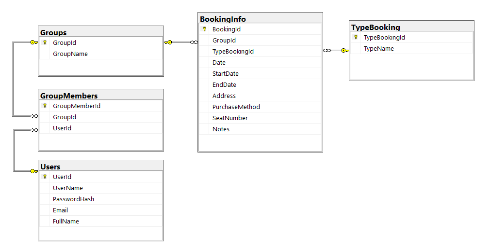

# 📦 bookingOrganizer_Api

A meticulously crafted **ASP.NET Core Web API** designed to provide a **robust backend** for a booking organization and sharing platform. This project showcases a **clean architecture**, smart **object mapping strategies**, and follows **modern .NET best practices**.

---

## 📚 Table of Contents

- ✨ [Project Vision](#project-vision)
- 🏗️ [Project Architecture](#project-architecture)
- 📊 [Database Schema](#database-schema)
- ⚙️ [Technologies Used](#technologies-used)
- 💡 [Design Highlights & Best Practices](#design-highlights--best-practices)
- 🔄 [Endpoint Sample Flow](#endpoint-sample-flow)
- 🚀 [Getting Started](#getting-started)
- 📂 [API Endpoint Reference](#api-endpoint-reference)
- 🔐 [Authentication & Login](#authentication--login)
- 📚 [Final Thoughts](#final-thoughts)

---

## ✨ Project Vision

> **Organize & Share Your Bookings Seamlessly**

The goal of **bookingOrganizer_Api** is to allow users to organize various bookings — such as **flights, hotels, events** — and **share them with others** through user-created groups. This enables easy collaboration, trip planning, or work event organization.

---

## 🏗️ Project Architecture

A layered and modular structure was chosen for **separation of concerns**, **testability**, and **maintainability**:

```
├── Controllers/         → API endpoints
├── DAO/                 → Data access logic (EF Core)
├── DTO/                 → Data Transfer Objects (API-safe models)
├── Exceptions/          → Custom exception classes
├── IDAO/                → DAO interfaces
├── Models/              → EF Core entity models
├── Repository/          → Service interfaces
├── Service/             → Business logic layer
├── UTILS/               → Manual mapping helpers
├── MappingProfiles/     → AutoMapper configuration
└── Program.cs           → Application startup
```

---

## 📊 Database Schema



### Core Entities:

- **Users**: Represents application users.
- **Groups**: Allows users to group bookings (e.g., "Work Trip", "Family Vacation").
- **GroupMembers**: Many-to-many relationship between Users and Groups.
- **BookingInfo**: Main table storing all booking data.
- **TypeBooking**: Categorization of bookings (Hotel, Flight, Event, etc.).

Relational links are enforced using **foreign keys**, ensuring data integrity across group-sharing and booking types.

---

## ⚙️ Technologies Used

| Component        | Technology / Package          | Reason for Use |
|------------------|-------------------------------|----------------|
| Framework        | ASP.NET Core                  | High-performance, scalable API development |
| ORM              | Entity Framework Core         | Simplifies DB access, supports migrations |
| DBMS             | SQL Server                    | Stable and scalable relational storage |
| DI               | Built-in .NET Dependency Injection | Promotes testability via constructor injection |
| Docs             | Swagger (Swashbuckle)         | Auto-generated API documentation |
| Mapping          | AutoMapper + Manual Mapping   | Efficient DTO-to-Entity conversion |
| Error Handling   | Custom Exception Types        | Improves debugging and user-friendly error messages |
| Data Security    | Hashed passwords (Login)      | Secure user credential storage |
| CORS             | Built-in .NET CORS            | Enables frontend-backend communication |

---

## 💡 Design Highlights & Best Practices

### ✅ Clean Dependency Injection

```csharp
public ServiceBookingInfo(IDAOBookingInfo daoBookingInfo, IMapper mapper)
{
    _daoBookingInfo = daoBookingInfo;
    _mapper = mapper;
}
```

- Promotes **loose coupling** and **unit testing**
- Adheres to **Inversion of Control (IoC)** principles

---

### ✅ Unified API Response Structure

```json
{
  "status": "200",
  "message": "Success",
  "data": {
    "bookingInfo": {
      "bookingId": 123,
      "date": "2025-07-01",
      "groupName": "Family Vacation",
      "type": "Hotel"
    }
  }
}
```

- Makes responses **predictable** and **frontend-friendly**

---

### 🔄 Mapping Strategies

#### ✅ AutoMapper

```csharp
public class BookingProfile : Profile
{
    public BookingProfile()
    {
        CreateMap<BookingInfo, DTOBookingInfo>();
        CreateMap<DTOBookingInfo, BookingInfo>();
        CreateMap<Group, DTOGroup>();
    }
}
```

Registered in `Program.cs`:

```csharp
builder.Services.AddAutoMapper(typeof(Program));
```

#### 🛠 Manual Mapping

Used when **custom logic or nested objects** are involved:

```csharp
public static ICollection<DTOGroup> ConvertGroupsToDTOGroups(ICollection<Group> groups)
{
    return groups.Select(g => new DTOGroup
    {
        GroupId = g.GroupId,
        GroupName = g.GroupName
    }).ToList();
}
```

---

### 📦 Why `ICollection<T>`?

Used in navigation properties and DTO returns:

```csharp
public virtual ICollection<BookingInfo> BookingInfos { get; set; }
```

✅ Reasons:
- Allows **modification** (add/remove) during object graph manipulation
- Plays well with **EF Core tracking**
- Ensures **interface-based programming**

---

## 🔄 Endpoint Sample Flow: `getBookingInfoById`

### 🔹 Controller

```csharp
[HttpGet("getBookingInfoById")]
public IActionResult GetBookingInfoById(int id)
{
    try
    {
        var dto = _repoBookingInfo.getBookingInfoById(id);
        return Ok(new Wrapper("200", "Success", new { bookingInfo = dto }));
    }
    catch (NotFoundException nf) { return NotFound(new Wrapper("404", nf.Message)); }
    catch (Exception ex) { return StatusCode(500, new Wrapper("500", ex.Message)); }
}
```

### 🔹 Service

```csharp
public DTOBookingInfo getBookingInfoById(int id)
{
    var booking = _daoBookingInfo.GetBookingInfoById(id);
    return _mapper.Map<DTOBookingInfo>(booking);
}
```

### 🔹 DAO

```csharp
public BookingInfo GetBookingInfoById(int id)
{
    var result = _context.BookingInfos.FirstOrDefault(b => b.BookingId == id);
    if (result == null) throw new NotFoundException($"Booking with ID {id} not found.");
    return result;
}
```

---

## 🚀 Getting Started

### 1. Clone the Repository

```bash
git clone https://github.com/your-username/bookingOrganizer_Api.git
cd bookingOrganizer_Api
```

### 2. Configure the Database

Update your `appsettings.json`:

```json
"ConnectionStrings": {
  "DefaultConnection": "Server=(localdb)\MSSQLLocalDB;Database=BookingOrganizerDB;Integrated Security=True;"
}
```

### 3. Run EF Core Migrations

```bash
dotnet ef database update
```

### 4. Launch the API

```bash
dotnet run
```

Visit: `https://localhost:7000/swagger` to interact with the API using Swagger UI.

---

## 📂 API Endpoint Reference

### 📁 BookingInfo

| Method | Endpoint |
|--------|----------|
| GET    | `/api/BookingInfo/getBookingInfoById` |
| GET    | `/api/BookingInfo/getBookings` |
| POST   | `/api/BookingInfo/addBooking` |
| DELETE | `/api/BookingInfo/removeBooking/{bookingId}` |
| PUT    | `/api/BookingInfo/updateBooking` |

### 📁 Group

| Method | Endpoint |
|--------|----------|
| GET    | `/api/Group/GetAllGroups` |
| GET    | `/api/Group/getGroupById` |
| POST   | `/api/Group/AddGroup` |
| DELETE | `/api/Group/RemoveGroup/{groupId}` |
| PUT    | `/api/Group/UpdateGroup` |

### 📁 GroupMember

| Method | Endpoint |
|--------|----------|
| GET    | `/api/GroupMember/GetGroupMembersByGroupId` |
| GET    | `/api/GroupMember/GetGroupMemberById` |
| POST   | `/api/GroupMember/AddGroupMember` |
| DELETE | `/api/GroupMember/RemoveGroupMember/{groupId}` |

### 📁 TypeBooking

| Method | Endpoint |
|--------|----------|
| GET    | `/api/TypeBooking/getTypeBookingById` |
| GET    | `/api/TypeBooking/getAllBookingTypes` |
| POST   | `/api/TypeBooking/addBookingType` |
| DELETE | `/api/TypeBooking/removeBookingType/{bookingTypeId}` |
| PUT    | `/api/TypeBooking/UpdateBookingType` |

### 📁 User

| Method | Endpoint |
|--------|----------|
| POST   | `/api/User/Login` |

---

## 🔐 Authentication & Login

This API uses a secure authentication mechanism based on **hashed passwords** and **JWT (JSON Web Tokens)** to protect user data and enable authenticated access to resources.

---

### Password Hashing

- Passwords are never stored as plain text.
- The project uses the `PasswordHashHandler` utility class to hash and verify passwords.
- Password hashing is done with **PBKDF2** (Password-Based Key Derivation Function 2) using **HMACSHA512**, with a unique salt per password.
- This approach protects against common attacks such as rainbow table or brute force attacks.

#### `PasswordHashHandler` Usage

- `HashPassword(string password)` — hashes a plain text password before saving.
- `VerifyPassword(string password, byte[] storedHash, byte[] storedSalt)` — verifies a password attempt against stored hash and salt.

---

### Login Flow

1. User submits **email** and **password** via the login endpoint `/api/User/Login`.
2. The service retrieves the stored password hash and salt for the email.
3. The provided password is hashed with the stored salt and compared with the stored hash.
4. On success, a **JWT token** is generated and returned for future authenticated requests.
5. On failure, an unauthorized error is returned.

---

### JWT Authentication

- The API generates JWT tokens that include user claims.
- These tokens are signed with a secret key.
- Clients include the JWT token in the `Authorization` header for secured endpoints.
- The API validates the token on each request to ensure authenticity and authorization.

---

## 📚 Final Thoughts

This project embraces **clean architecture principles**, uses **EF Core** for data access, and focuses on **security best practices** in authentication. It provides a solid foundation for scalable booking management applications and easy frontend integration.

---
